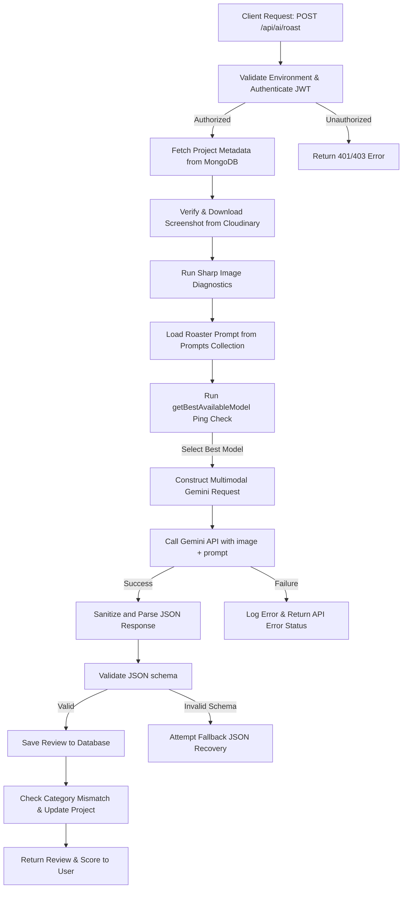
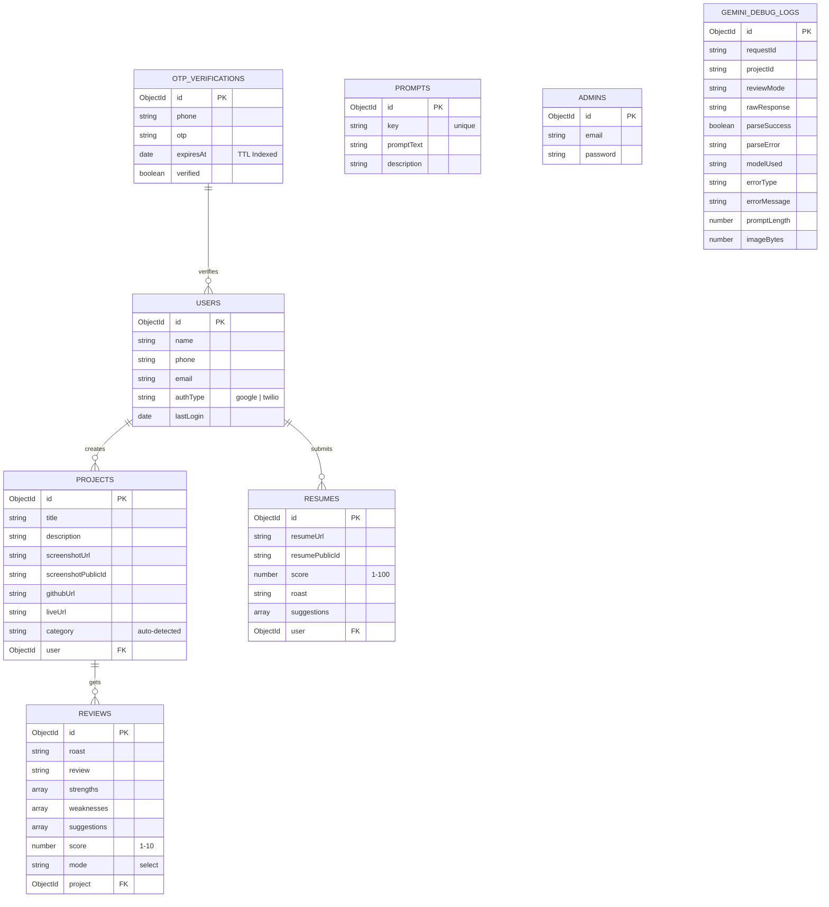

# 🔥 Roast My Project

> Get brutal, funny, or professional AI feedback on your engineering projects and resumes. Boost your designs, improve your system architecture, and prepare for interviews using Gemini AI.

---

## 📸 Project Preview


---

## 🛠️ Stack & Technologies

The application is built on a modern, high-performance tech stack utilizing a Unified Serverless Next.js architecture integrated with a Headless CMS backend and multi-modal generative AI pipelines.

| Layer | Technologies / Packages | Description |
| :--- | :--- | :--- |
| **Frontend Framework** | **Next.js 15+** (App Router), React 19, TypeScript | High-performance, SEO-friendly, server-side rendered foundation with client-side interactive routing. |
| **Styling** | **Tailwind CSS v4**, PostCSS | Sleek, glassmorphic layout and dark-mode styling utilizing modern CSS custom property theme mappings. |
| **AI Integration** | **@google/generative-ai** (Gemini API) | Multimodal prompts analyzing base64 encoded screenshots and PDF document attachments. |
| **Database & CMS** | **Payload CMS 3.x**, **MongoDB** (Mongoose) | Unified backend dashboard, API Router, schema management, and local database API. |
| **Authentication** | **Firebase Admin SDK** (Google OAuth), **Twilio** (SMS OTP), JWT | Multi-channel authorization flow issuing custom JWT tokens verified on protected route handlers. |
| **Media Hosting** | **Cloudinary** | Cloud host for screenshot uploads and resume PDF files. |
| **Diagnostics** | **Sharp**, Axios, Custom Health Routes | Automated image validation metrics, API latency testing, and system diagnostics. |

---

## ⚙️ System Workflow & Architecture

The application handles two primary workflows: **Project Roasts** (Multimodal screenshots + metadata) and **Resume Reviews** (PDF document parsing).

### 1. Roast Request Pipeline


### 2. Multi-Channel Authentication Workflow
* **Google OAuth**: Users authenticate client-side via Google Sign-In with Firebase, generating an ID Token. The server decrypts and validates the token using the `firebase-admin` SDK, creates/updates the User record in MongoDB, and signs an application-level JWT.
* **SMS OTP (Twilio)**: Users request a verification code sent to their mobile device. If Twilio environment variables are unconfigured, the system automatically falls back to **Mock Developer Mode**, outputting the generated code to the server log and return payloads for local testing convenience.

---

## 🗄️ Database Schema Design (UML / ERD)

Managed dynamically via **Payload CMS collections** backed by MongoDB. Prompt templates are seeded automatically during the database initializing hook.



---

## 📂 Codebase File Tree

The workspace uses a unified structure where Payload CMS is mounted onto Next.js routes under the `(payload)` path, and the user application runs under `(app)`.

```
.
├── payload.config.ts                      # Payload CMS Configuration (Collections & DB adapters)
├── next.config.ts                         # Next.js configurations
├── package.json                           # Workspace scripts & dependencies
├── tsconfig.json                          # TypeScript project compiler definitions
├── eslint.config.mjs                      # Linter properties
├── postcss.config.mjs                     # PostCSS configurations
└── src/
    ├── test-gemini.ts                     # Standalone Gemini API prompt validation script
    ├── test-gemini-models.ts              # Model listing diagnostic script
    ├── assets/
    │   └── Screenshot 2026-06-05 002234.png # Project Preview image
    ├── config/
    │   └── gemini.ts                      # Gemini API client & fallback health manager
    ├── context/
    │   └── AuthContext.tsx                # Frontend Auth Provider & route guardian
    ├── lib/
    │   ├── env.ts                         # Startup Environment validator
    │   ├── errors.ts                      # Gemini error classification translator
    │   └── timing.ts                      # Multi-stage request duration timer
    ├── types/
    │   └── ai.ts                          # Structured Review interfaces and runtime guards
    ├── utils/
    │   ├── apiClient.ts                   # Custom Axios API configuration (auto JWT inclusion)
    │   ├── auth.ts                        # JWT utilities (signing, decoding, validation)
    │   └── firebase.ts                    # Firebase Client SDK initializer
    ├── components/
    │   ├── AdminAnalytics.tsx             # Analytics widget injected before Payload dashboard
    │   ├── ErrorState.tsx                 # Standardized component for handling runtime failures
    │   └── SkeletonLoader.tsx             # Content loading placeholders
    ├── collections/                       # MongoDB collection configurations for Payload
    │   ├── Admins.ts                      # Payload Admin users
    │   ├── Users.ts                       # Application clients
    │   ├── OtpVerifications.ts            # Verification registers (MongoDB TTL indexed)
    │   ├── Projects.ts                    # User uploads (Titles, category & Cloudinary metadata)
    │   ├── Reviews.ts                     # Generated project evaluations
    │   ├── Resumes.ts                     # Generated resume reviews
    │   ├── Prompts.ts                     # Dynanic system prompts for roasting modes
    │   └── GeminiDebugLogs.ts             # Raw API payloads and parsing diagnostics
    └── app/
        ├── favicon.ico
        ├── (payload)/                     # Next.js router mappings mounting the Payload Admin portal
        │   ├── admin/
        │   │   ├── importMap.js           # Compiled admin assets imports
        │   │   ├── importMap.ts
        │   │   └── [[...slug]]/           # Dynamic Admin Panel route catcher
        │   └── api/
        │       └── [[...slug]]/           # Dynamic Payload CMS API router
        └── (app)/                         # Next.js User Application Routes
            ├── globals.css                # Global styling utilizing Tailwind CSS v4 variables
            ├── layout.tsx                 # App entry setup mounting layout shells & Auth Provider
            ├── page.tsx                   # Interactive project landing page
            ├── login/                     # Phone OTP & Google Auth portal login screen
            ├── verify-otp/                # SMS OTP code verification terminal
            ├── dashboard/                 # User workspace displaying statistics and projects
            ├── submit/                    # Form for posting a project and uploading screenshots
            ├── resume/                    # Portal for uploading and analyzing PDF resumes
            ├── profile/                   # User profile manager
            ├── results/                   # Detailed results screens
            │   ├── project/[id]/          # Detailed report for project roasts
            │   └── resume/[id]/           # Detailed report for resume reviews
            └── api/                       # REST endpoint route handlers
                ├── upload/                # Cloudinary image/pdf stream upload
                ├── projects/              # CRUD endpoints for managing projects
                │   └── [id]/
                ├── reviews/               # Fetch evaluations and reviews
                │   └── [id]/
                ├── dashboard/stats/       # Dashboard metrics (Averages, timelines, Recharts data)
                ├── admin/stats/           # System analytics summaries for Payload admins
                ├── debug/roast-health/    # Server dependency diagnostic endpoint
                ├── auth/
                │   ├── firebase-login/    # Google Login token validation
                │   ├── send-otp/          # Generate & send Twilio SMS OTP
                │   └── verify-otp/        # Validate OTP & return custom signed JWT
                └── ai/
                    ├── roast/             # Gemini Roast orchestrator (Image analysis)
                    └── resume-review/     # Gemini Resume orchestrator (PDF document analysis)
```

---

## 🔑 Environment Variables Setup

Create a `.env` file in the root directory and configure the following keys:

```env
# MongoDB Connection
MONGODB_URI=your_mongodb_connection_string

# Payload CMS Configuration
PAYLOAD_SECRET=your_payload_session_signing_secret
PAYLOAD_PUBLIC_SERVER_URL=http://localhost:3000

# Application JWT Authorization Secret
JWT_SECRET=your_jwt_signing_secret_for_app_users

# Gemini API Integration
GEMINI_API_KEY=your_gemini_developer_api_key
ENABLE_GEMINI_DEBUG=true

# Cloudinary Integration (Media Storage)
CLOUDINARY_CLOUD_NAME=your_cloudinary_cloud_name
CLOUDINARY_API_KEY=your_cloudinary_api_key
CLOUDINARY_API_SECRET=your_cloudinary_api_secret

# Twilio SMS OTP Configuration
TWILIO_ACCOUNT_SID=your_twilio_sid
TWILIO_AUTH_TOKEN=your_twilio_auth_token
TWILIO_PHONE_NUMBER=your_twilio_phone_number

# Frontend Firebase Configuration (Exposed)
NEXT_PUBLIC_FIREBASE_API_KEY=your_firebase_api_key
NEXT_PUBLIC_FIREBASE_AUTH_DOMAIN=your_firebase_auth_domain
NEXT_PUBLIC_FIREBASE_PROJECT_ID=your_firebase_project_id
NEXT_PUBLIC_FIREBASE_STORAGE_BUCKET=your_firebase_storage_bucket
NEXT_PUBLIC_FIREBASE_MESSAGING_SENDER_ID=your_firebase_sender_id
NEXT_PUBLIC_FIREBASE_APP_ID=your_firebase_app_id
NEXT_PUBLIC_FIREBASE_MEASUREMENT_ID=your_firebase_measurement_id
```

*Note: If Twilio credentials are left empty, the application will default to Mock OTP verification mode (printing the OTP codes inside your terminal).*

---

## 🚀 Getting Started

Follow these steps to run the application locally:

### 1. Install Dependencies
```bash
npm install
```

### 2. Run the Development Server
```bash
npm run dev
```
Open [http://localhost:3000](http://localhost:3000) in your browser to view the application.

### 3. Access Payload Admin Dashboard
Navigate to [http://localhost:3000/admin](http://localhost:3000/admin) to log into the Payload CMS interface. You can create an admin profile on the first load, which will auto-seed the default roaster prompt templates (`Funny Roast`, `Brutal Roast`, etc.) into your MongoDB instance.

### 4. Build for Production
```bash
npm run build
npm start
```
