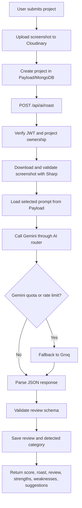
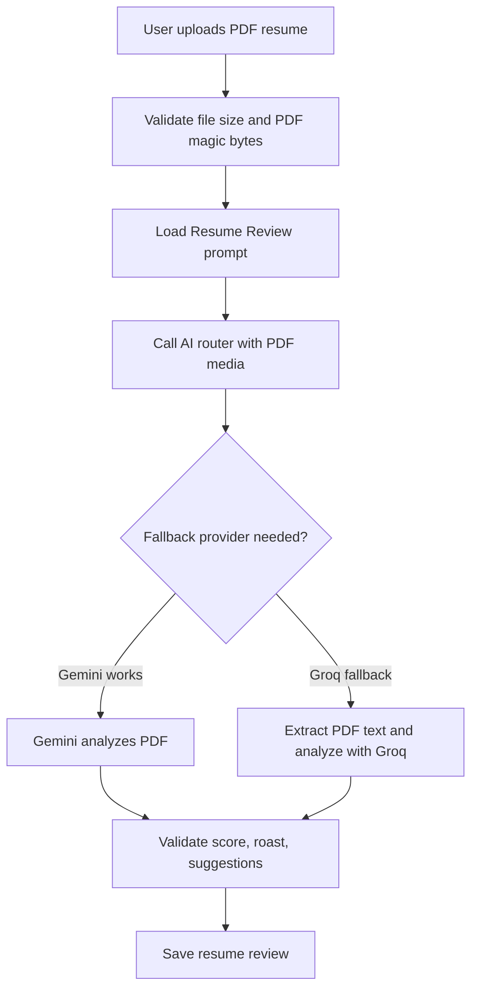
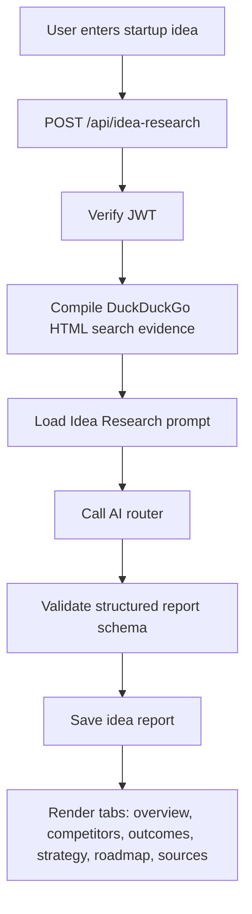

# Roast My Project

AI feedback for builders who want more than a generic thumbs-up.

Roast My Project lets users submit engineering projects, screenshots, resumes, and startup ideas, then receive structured AI feedback through multiple review modes. The upgraded app now runs on Next.js 16, React 19, Payload CMS 3, Gemini, Groq fallback routing, Cloudinary uploads, Firebase/Twilio authentication, and a new grounded idea-research workflow.


## What It Does

- Project roasts from screenshots, descriptions, GitHub links, and live URLs.
- Multiple review modes: Funny Roast, Brutal Roast, Recruiter Review, Senior Developer Review, and Investor Review.
- Resume review with PDF validation, AI scoring, and concrete improvement suggestions.
- Idea Intelligence reports for startup concepts, including competitors, market risks, MVP roadmap, VC questions, and source-backed evidence.
- User dashboard with projects, reviews, resume results, idea reports, and analytics.
- Payload admin dashboard for managing users, prompts, reviews, uploaded records, and AI debug logs.
- Google OAuth and phone OTP login with JWT-protected API routes.
- Gemini-first AI routing with Groq fallback for quota and rate-limit failures.

## Tech Stack

| Layer | Technology |
| --- | --- |
| App framework | Next.js 16.2.7, App Router, React 19.2.4, TypeScript |
| Styling | Tailwind CSS v4, PostCSS |
| CMS and database | Payload CMS 3.85, MongoDB via `@payloadcms/db-mongodb` |
| AI providers | Google Gemini via `@google/generative-ai`, Groq OpenAI-compatible chat completions |
| Uploads and media | Cloudinary, Sharp image diagnostics |
| Authentication | Firebase client/admin auth, Twilio OTP, app JWTs |
| Charts and UI | Recharts, Lucide React, canvas-confetti |
| Tooling | ESLint 9, TypeScript 5, `tsx` diagnostics |

## Main Workflows

### Project Review



### Resume Review



### Idea Intelligence



## Routes

### User Pages

| Route | Purpose |
| --- | --- |
| `/` | Landing and entry experience |
| `/login` | Google and phone login |
| `/verify-otp` | OTP confirmation flow |
| `/dashboard` | User workspace and stats |
| `/submit` | Project submission |
| `/resume` | Resume upload and review |
| `/idea-research` | Startup idea validation reports |
| `/profile` | User profile |
| `/results/project/[id]` | Project review results |
| `/results/resume/[id]` | Resume review results |
| `/admin` | Payload CMS admin dashboard |

### API Routes

| Route | Purpose |
| --- | --- |
| `/api/auth/firebase-login` | Firebase ID token verification and app JWT issue |
| `/api/auth/send-otp` | Twilio or mock OTP generation |
| `/api/auth/verify-otp` | OTP validation and app JWT issue |
| `/api/upload` | Cloudinary upload endpoint |
| `/api/projects` | Project list and creation |
| `/api/projects/[id]` | Project detail, update, and delete |
| `/api/ai/roast` | Project screenshot analysis |
| `/api/ai/resume-review` | Resume PDF analysis |
| `/api/reviews` | Review listing |
| `/api/reviews/[id]` | Review detail |
| `/api/idea-research` | Idea report list and creation |
| `/api/idea-research/[id]` | Idea report detail with ownership check |
| `/api/dashboard/stats` | User dashboard metrics |
| `/api/admin/stats` | Payload admin analytics |
| `/api/debug/roast-health` | Roast pipeline diagnostics |

## Data Model

Payload CMS manages the application collections:

- `admins`: Payload dashboard users.
- `users`: App users authenticated by Google or phone OTP.
- `otp_verifications`: OTP records with a MongoDB TTL index.
- `projects`: Submitted project metadata and Cloudinary screenshot references.
- `reviews`: AI-generated project reviews.
- `resumes`: Resume review results and uploaded PDF metadata.
- `prompts`: Editable prompt templates for every review mode.
- `gemini_debug_logs`: AI request diagnostics, provider used, model used, raw output, parse status, and errors.
- `idea_reports`: Grounded startup research reports with market, risk, roadmap, and source data.

Default prompts are seeded on Payload initialization when missing.

## Environment Variables

Create `.env` in the project root.

```env
# Database
MONGODB_URI=mongodb://127.0.0.1:27017/roast-my-project
# or
DATABASE_URI=mongodb://127.0.0.1:27017/roast-my-project

# Payload
PAYLOAD_SECRET=replace_with_a_long_secret
PAYLOAD_PUBLIC_SERVER_URL=http://localhost:3000

# App auth
JWT_SECRET=replace_with_a_long_jwt_secret

# AI providers
GEMINI_API_KEY=your_gemini_api_key
GROQ_API_KEY=your_groq_api_key
ENABLE_GEMINI_DEBUG=true

# Cloudinary
CLOUDINARY_CLOUD_NAME=your_cloud_name
CLOUDINARY_API_KEY=your_api_key
CLOUDINARY_API_SECRET=your_api_secret

# Twilio OTP
TWILIO_ACCOUNT_SID=your_account_sid
TWILIO_AUTH_TOKEN=your_auth_token
TWILIO_PHONE_NUMBER=your_twilio_number

# Firebase client config
NEXT_PUBLIC_FIREBASE_API_KEY=your_firebase_api_key
NEXT_PUBLIC_FIREBASE_AUTH_DOMAIN=your_project.firebaseapp.com
NEXT_PUBLIC_FIREBASE_PROJECT_ID=your_project_id
NEXT_PUBLIC_FIREBASE_STORAGE_BUCKET=your_project.appspot.com
NEXT_PUBLIC_FIREBASE_MESSAGING_SENDER_ID=your_sender_id
NEXT_PUBLIC_FIREBASE_APP_ID=your_app_id
NEXT_PUBLIC_FIREBASE_MEASUREMENT_ID=your_measurement_id
```

`MONGODB_URI` or `DATABASE_URI` is required. The runtime env validator also requires `PAYLOAD_SECRET`, `GEMINI_API_KEY`, `GROQ_API_KEY`, and the Cloudinary keys. If Twilio is not configured, the OTP route can fall back to local mock behavior for development.

## Getting Started

Install dependencies:

```bash
npm install
```

Run the development server:

```bash
npm run dev
```

Open [http://localhost:3000](http://localhost:3000).

Open the Payload admin dashboard at [http://localhost:3000/admin](http://localhost:3000/admin). On first setup, create the admin user; prompt templates and the OTP TTL index are initialized during Payload startup.

## Scripts

| Command | Description |
| --- | --- |
| `npm run dev` | Start the Next.js development server |
| `npm run build` | Build for production |
| `npm start` | Start the production server |
| `npm run lint` | Run ESLint |
| `npm run typecheck` | Run TypeScript without emitting files |
| `npm run test:gemini-models` | Check available Gemini models using `.env` |

## Project Structure

```text
.
├── payload.config.ts
├── next.config.ts
├── package.json
├── src
│   ├── app
│   │   ├── (app)
│   │   │   ├── api
│   │   │   ├── dashboard
│   │   │   ├── idea-research
│   │   │   ├── login
│   │   │   ├── profile
│   │   │   ├── resume
│   │   │   ├── results
│   │   │   ├── submit
│   │   │   └── verify-otp
│   │   └── (payload)
│   │       ├── admin
│   │       └── api
│   ├── collections
│   ├── components
│   ├── config
│   ├── context
│   ├── lib
│   ├── types
│   └── utils
└── public
```

## Notes For Development

- This repository uses the upgraded Next.js package installed in `node_modules`. Check `node_modules/next/dist/docs/` before changing framework-specific code.
- Keep prompt behavior editable through the `prompts` collection instead of hardcoding new review instructions in route handlers.
- AI responses are treated as untrusted JSON and validated in `src/types/ai.ts` before saving.
- The AI router prefers Gemini and uses Groq only for quota or rate-limit fallback paths.
- Idea research uses app-side search evidence from DuckDuckGo HTML results, then asks the AI model to produce a structured report from that evidence.
